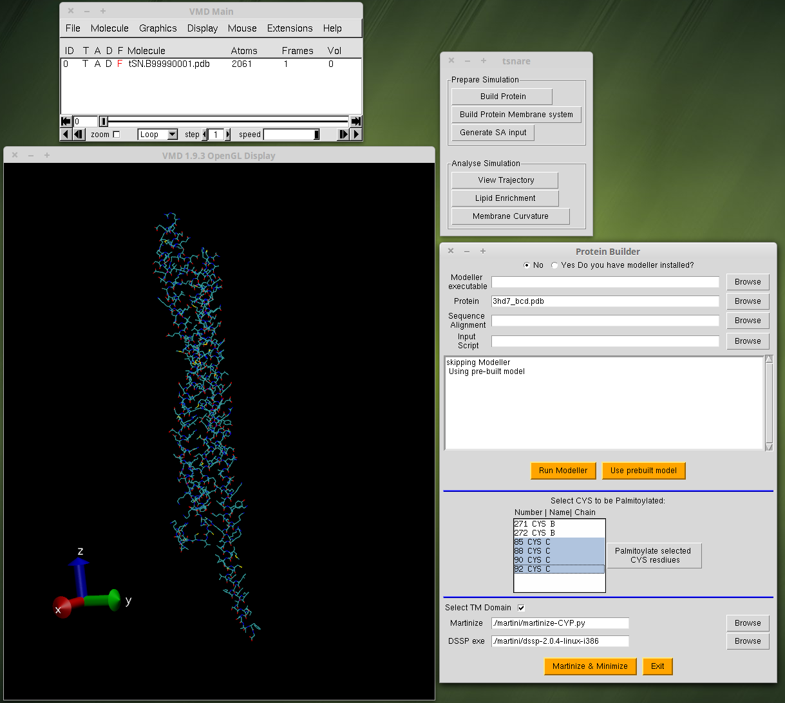
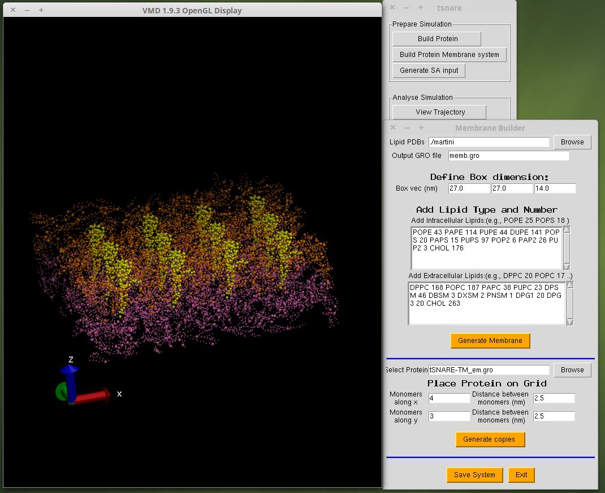

## Aim
These scripts are written to provide a GUI on top of Visual Molecular Dynamics (VMD) to perform self-assembly Coarse-grained MD simulation on clustering of t-SNARE transmembrane domains. 

## Setup & Usage
Just copy the `scripts` and `martini` folders to the working directory and source `scripts/tsnare.tcl` as:

`vmd -e scripts/tsnare.tcl`

## Tools

### Modeling the Protein

### Building the Lipid Membrane and inserting protein

